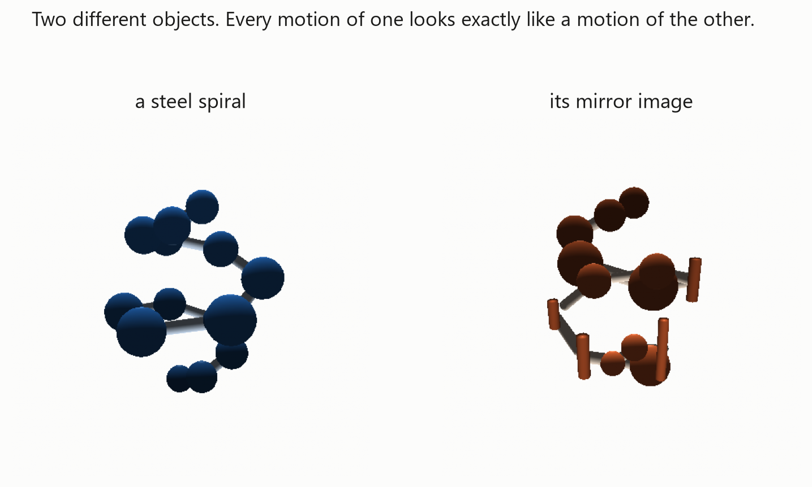
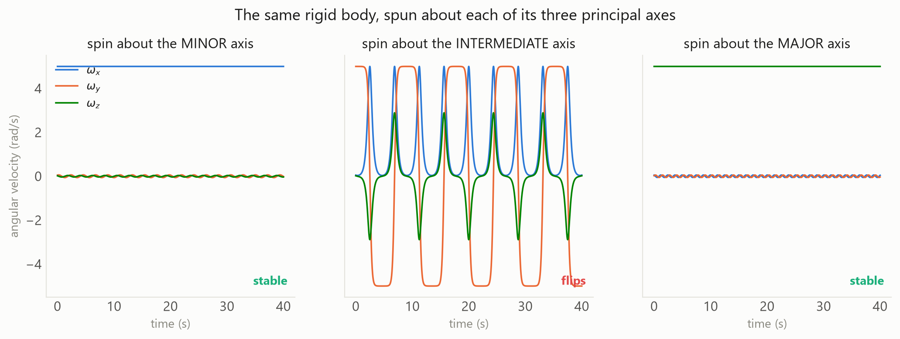
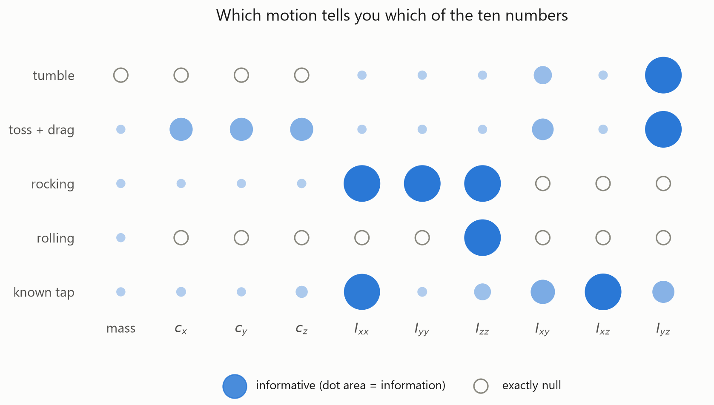
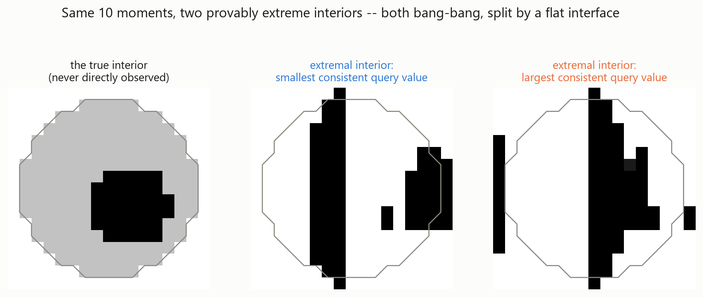
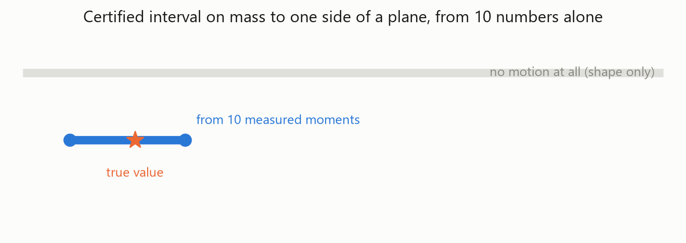
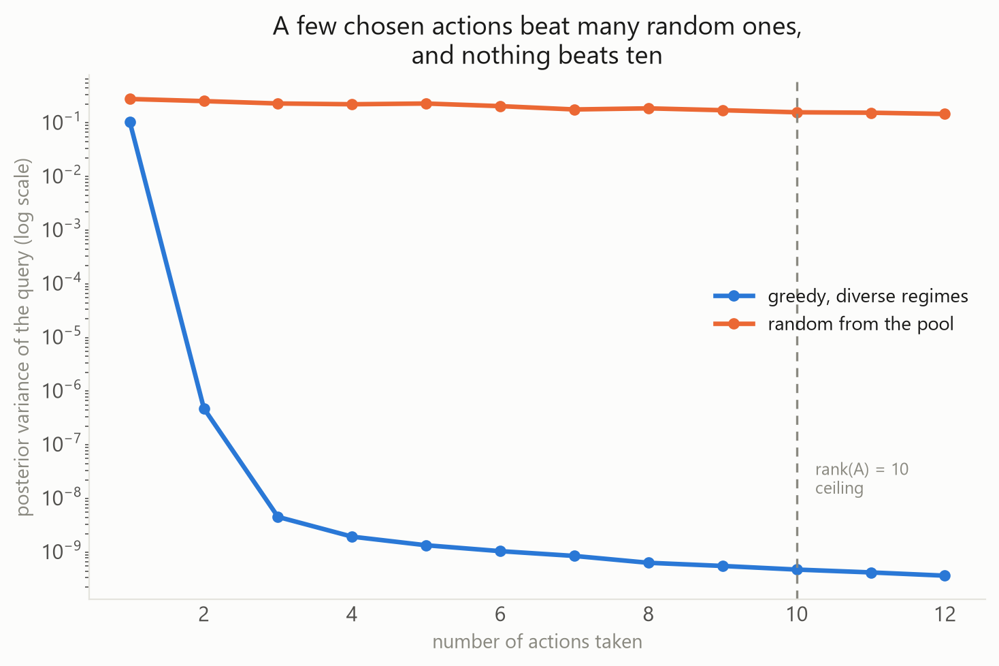
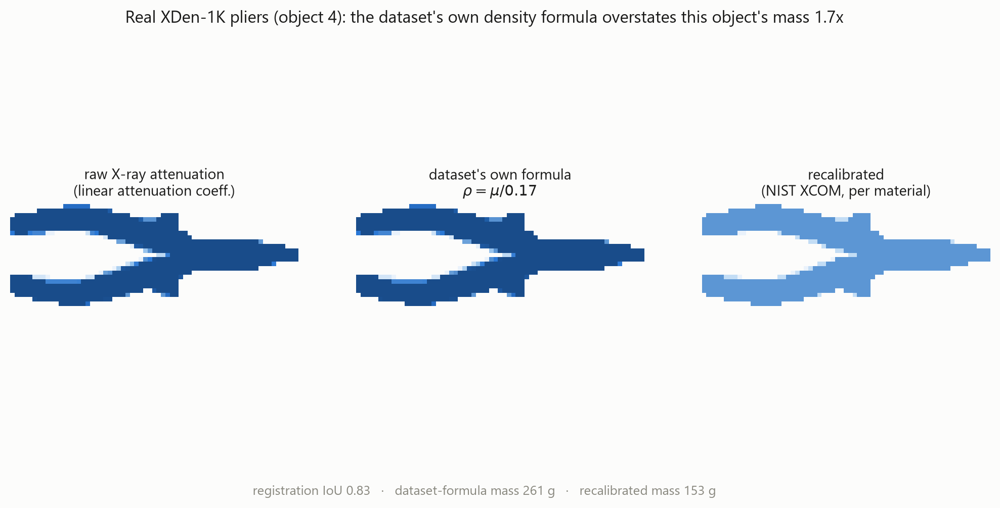
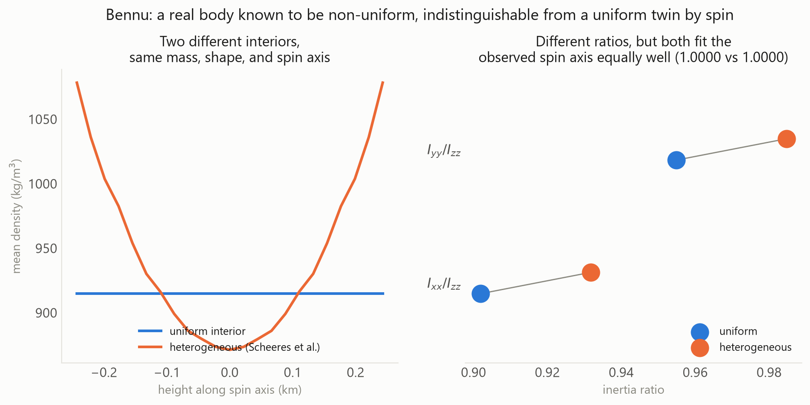
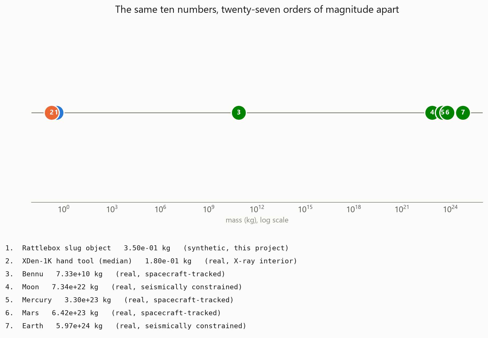

<div align="center">

# BALLAST

**Certified bounds on what is inside an object, from video of how it moves.**


</div>

## The patent this project disagrees with

United States Patent 12,281,955 B2, granted in 2025, describes a method for estimating the internal mass distribution of an object by rotating it about many different axes and measuring the resulting motion. Its central premise is that more axes means less uncertainty.

That premise is false, and it is false for a reason that predates the patent by over a century. The moment of inertia about any axis `n` is

```
I(n) = n^T I n
```

a fixed quadratic form in the same six numbers (the independent entries of the inertia tensor `I`) no matter which `n` you choose. Spinning an object about a thousand different axes measures the same six-number object a thousand times. It reduces measurement noise by averaging. It adds exactly zero new information about the interior beyond those six numbers, because there is no new information left to add: a rigid body's entire dynamical response to any motion, forever, is governed by ten numbers total (mass, three coordinates of the center of mass, six independent inertia components), regardless of how the mass producing those ten numbers happens to be arranged inside.

This repository is what follows from taking that limit seriously instead of past it: not a method for seeing inside an object, which the physics forbids, but a method for saying exactly how much a given motion sequence can and cannot tell you, with a certificate, validated against real interiors nobody built for this purpose.

## Two exact theorems

**Mass is invisible to gravity-driven motion.** Under gravity and unilateral contact with an unknown reaction force, the equations of motion are exactly homogeneous of degree one in mass: scale `m`, `I`, and every contact force by the same `lambda` and the trajectory does not change by a single bit. Absolute mass cannot be recovered from watching an object fall, roll, or rock; the recoverable object is `(c, I/m)`, nine numbers, not ten. Only a known applied impulse or a calibrated drag force breaks the degeneracy.

**Chirality is invisible to any rigid-body motion, ever.** Point-reflect the interior of any object through its own center of mass and the mass, center of mass, and inertia tensor are exactly unchanged, for any density field, with no symmetry required. Two objects that are mirror images of each other, built from the same materials in opposite handedness, are dynamically identical forever.

<p align="center"></p>

<div align="center">

| | mass (kg) | center of mass (m) |
|---|---|---|
| spiral | 14.0 | (3.970e-4, 2.885e-4, 1.5e-18) |
| its mirror twin | 14.0 | (3.970e-4, 2.885e-4, -1.5e-18) |

</div>

Mass differs by exactly `0.0`; center of mass differs by `3e-18` m; the full inertia tensor differs by `3e-18` kg m², both at the floor of IEEE-754 double precision.

Neither of these is a new observation on its own. Wilczek (arXiv:2309.04882) constructs motion-identical bodies explicitly; the annihilator of the moment operator has been known in geophysics since Parker (1975); Spin-It (SIGGRAPH 2014) depends on the same null space to design mass distributions. What is built on top of it here is new: a way to say, given that null space, exactly what a fixed measurement can still pin down, and how to spend a limited number of measurements to pin down as much of it as possible.

Every number in this repository that depends on simulated motion comes from one rigid-body integrator, and that integrator reproduces a famous instability nobody had to tell it about: spin a body about its intermediate principal axis and it periodically tumbles, while spin about the smallest or largest axis stays put. This is the Dzhanibekov effect, and it falls directly out of Euler's equations with no special-casing.

<p align="center"></p>

## The ten-number bottleneck

Every regime a rigid body can be put through, tumbling, rocking, rolling, tapped, tossed with drag, reveals information about a strict subset of the same ten numbers, never about the interior directly. The figure below is not illustrative; it is the diagonal of the real Fisher information matrix for five regimes this repository implements, evaluated at a fixed test object.

<p align="center"></p>

Free tumbling, unaided by anything else, sees only the shape of the inertia tensor: it cannot see the mass or the center of mass at all, because rotation about the body's own center reveals nothing about where that center is. A rocking or rolling regime sees only one or two diagonal inertia terms. A single tap with a known, measured impulse is the only regime here that is close to full rank. This is the quantitative form of the same limit the patent gets wrong: no amount of one regime substitutes for a different one, and no regime substitutes for the ten-number ceiling itself.

## What the null space still allows you to certify

Given the outer shape of an object, a material density bound, and the ten moments a motion sequence actually measures, the tightest possible answer to any linear question about the interior, how much mass sits in a given octant, within a given radius, on one side of a plane, is not a guess. It is the solution to a linear program, and duality guarantees the solution has a specific, striking structure: the worst-case interior is always two-valued (either empty or at the material's maximum density) separated by a flat or quadric interface, with at most ten voxels sitting in between. This is Parker's ideal-body construction from gravity inversion, carried over to the rigid-body moment operator.

<p align="center"></p>
<p align="center"></p>

On the synthetic interior these two figures come from, ten measured moments alone narrow the certified interval to 18% of the width available with the shape and material bound but no motion at all. The true, hidden value always sits inside the certified interval, because the interval is not a confidence estimate; it is a proof.

## The reduction that makes "how should I move it" a solved problem

Because a motion depends on the interior only through the ten numbers, choosing which motion to perform next in order to learn about a specific interior question is not a new algorithm to invent. It is classical linear-Gaussian optimal experiment design with a goal-oriented objective (minimize the posterior width of the actual question, not generic uncertainty about all ten numbers), and it inherits a hard ceiling for free: since the moment operator has rank ten, no policy, however clever, can extract more than ten informative directions no matter how many actions it spends.

<p align="center"></p>

Three greedily chosen, diverse actions out of a pool of forty-five candidates (mostly redundant rocking pivots, a few genuinely informative tumbles and taps) already land a posterior variance more than seven orders of magnitude below what even a full twelve-action random policy from the same pool achieves. Past the tenth action, the greedy curve is essentially flat: the ceiling is not a suggestion.

## Validated against interiors nobody built for this

No public dataset pairs real video of a tumbling object with an independently measured interior mass distribution. That pairing does not exist yet, on any object, anywhere. What does exist is three separate real anchors, each covering a different half of the problem, used here honestly rather than blended into an inflated single claim.

### A real X-ray interior, and a real error in how the dataset reports it

XDen-1K (ECCV 2026, 882 real objects, biplanar X-ray density fields, CC-BY-4.0) converts attenuation to density with a single fixed formula, `density = attenuation / 0.17`, calibrated for water, polymers, and aluminum. The dataset is dominated by steel hand tools. NIST's XCOM mass-attenuation tables give a very different conversion for iron at the tube energies XDen-1K was scanned at, which means the published formula overstates the mass of every ferrous object it contains, sometimes severely.

<p align="center"></p>

This object (a real pair of pliers, registered to its X-ray volume at 0.83 IoU) is reported by the dataset's own formula as 261 grams. A NIST-XCOM, per-material recalibration puts it at 153 grams, a real pair of pliers being closer to a real pair of pliers than the dataset's own number. Registration is not free: over the first 40 objects, the brute-force mesh-to-volume search clears the plan's own 0.7 IoU accept threshold on 68% of objects (median IoU 0.767), reported here rather than silently discarded.

### A real asteroid whose interior is independently known to be non-uniform

Bennu's interior was found to be non-uniform (denser toward the poles, underdense at the center and equatorial bulge) from spacecraft radio tracking, an entirely different kind of measurement from spin dynamics. Building a uniform-density model that shares Bennu's real mass, shape, and spin axis produces a body whose spin-axis alignment with the true observed rotation agrees with the real heterogeneous model to five decimal places, despite the two interiors having measurably different inertia ratios. Spin alone, exactly as the theory here predicts, cannot tell you which one is real; that is precisely why the actual discovery needed gravity tracking instead.

<p align="center"></p>

### Four real planets, cross-checked two independent ways

The same physics scales up forty-five orders of magnitude without changing form. A two-layer core/mantle model, given only each planet's real mass and literature mineral densities, predicts a core radius; that prediction is cross-checked against the planet's independently measured, spin-derived moment-of-inertia factor.

| body | predicted core radius (fraction of R) | published core radius (fraction of R) | predicted moment-of-inertia factor | observed moment-of-inertia factor |
|---|---|---|---|---|
| Earth | 0.606 | 0.55 | 0.3305 | 0.3307 |
| Mars | 0.590 | 0.50 | 0.3646 | 0.3644 |
| Mercury | 0.817 | 0.82 | 0.3479 | 0.3460 |
| Moon | 0.174 | 0.23 | 0.3974 | 0.3930 |

<p align="center"></p>

### What did not make it in, said plainly

SPHERES-VERTIGO has real free-tumbling video of an ISS satellite with independently known CAD inertia ratios, exactly the kind of anchor this project wants most. Its telemetry is serialized in MATLAB's proprietary MCOS class-object format; both `scipy.io.loadmat` and `pymatreader` were tried directly against the real file and neither can deserialize it. This is a genuine dead end, not a shortcut taken. Physics 101 (MIT CSAIL, 4.8 GB, hollow-versus-solid object pairs on real video with measured mass) downloaded successfully but is raw footage with no bundled per-object ground truth file; extracting it would mean building a full tracking and volume-estimation pipeline, which is future work rather than something quietly assumed done.

## What this project is not claiming

- Not "first to characterize the null space." Wilczek (2023) does this for point masses; Parker (1975) and Spin-It (2014) both depend on it.
- Not "reconstructs a 3D map of the interior from video." The two theorems above forbid it categorically. The honest claim is a certified interval, not a picture.
- Not "first observability analysis across motion regimes." Fazeli et al. and Wensing et al. cover the structural per-regime results already; what is new here is pushing those results through to interior queries with real Cramer-Rao numbers.
- Not "non-destructive alternative to X-ray." A certified interval on a handful of linear queries is not a micron-resolution volumetric scan, and is not presented as one.

## How it is built, and why

| decision | rejected | chosen | reason |
|---|---|---|---|
| rendering | PyTorch3D / nvdiffrast | `moderngl` standalone OpenGL, plus a NumPy scanline fallback | no CUDA toolkit build, immune to shared-GPU VRAM contention, 1500 to 4000 fps at 128×128 |
| pose refinement | a CNN regressor | template init, then Gauss-Newton against a signed distance transform of the silhouette | never differentiates a rendering pipeline; never forms angular velocity by finite differences, which is the dominant real-world noise source |
| contact dynamics | differentiate through impact events | closed-form per-regime models (FFT-based rocking frequency, rolling acceleration, tap-impulse recovery) | gradients through repeated impacts blow up; the closed-form problems are smooth and measurable to about 1% |
| inertia from tumbling | fit an ODE to a trajectory | a single linear null-space solve (SVD) on conserved angular momentum | no simulation loop, no gradients, and the operation's own condition number is the near-symmetry diagnostic |
| numerics | JAX | NumPy and SciPy, `scipy.optimize.linprog` (HiGHS) for the certified bounds | every Jacobian in this codebase is ten columns wide; the interesting artifact is the closed-form derivation, not a framework |

Two physics-derived checks pass to `1e-10` across the test suite and are stronger evidence than the working code around them: for gravity and contact regimes, the Fisher information matrix has an exact null eigenvector along the mass-homogeneity direction; for free tumbling, the null space is exactly two-dimensional, no more and no less.

## Try the certified bound narrow in your own browser

`explorer/index.html` is a single self-contained file (no server, no network, no build step) that runs the same linear program this repository uses everywhere else, live, as you drag a slider from zero moments known to all ten. It renders the two extremal interiors at every step so you can watch the space of interiors consistent with the evidence visibly collapse toward the true, hidden one.

## Reproducing this

```
pip install -e ".[dev]"
python scripts/run_all.py
```

Real-data figures that need the XDen-1K download are skipped automatically if `data/xden1k/` is not present; everything else, including all 144 tests, runs from this repository alone. `scripts/download_xden1k.py` fetches the real dataset (16 GB) if you want the full picture.

The source tree separates cleanly along the theory: `moments/` holds the operator, the reflection theorem, and the sharp-bound linear programs; `identify/` holds the Fisher-information atlas and the SVD-based inertia solve; `physics/` and `render/` and `pose/` are the forward simulator, renderer, and pose refinement that generate and recover synthetic evidence; `data/` holds every real-anchor ingestion path; `active/` holds the goal-oriented experiment design; `rattlebox/` generates the synthetic object population these figures draw test cases from.
